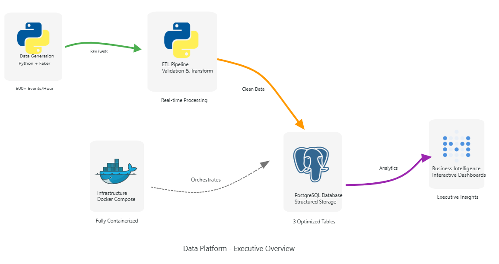

# 🚀 Mini Resilient Data Platform

> A production-ready data engineering pipeline demonstrating end-to-end data flow, transformation, and business intelligence capabilities.

[](https://python.org)
[](https://postgresql.org)
[](https://docker.com)
[](https://metabase.com) 

## 🎯 Project Overview

This project demonstrates core **Data Engineering** and **DataOps** principles through a complete, local data platform that simulates real-world e-commerce analytics. Built with enterprise-grade tools and best practices, it showcases data pipeline design, monitoring, and business intelligence capabilities.

### Key Capabilities
- **Data Generation**: Realistic e-commerce event simulation using Python + Faker
- **Data Pipeline**: Robust ETL with error handling and retry mechanisms  
- **Data Storage**: PostgreSQL with optimized schema design
- **Data Transformation**: SQL-based business metrics and KPIs
- **Data Quality**: Automated validation and monitoring
- **Business Intelligence**: Interactive dashboards with real-time insights

## 🏗️ Architecture



### System Components

| Layer | Component | Purpose |
|-------|-----------|---------|
| **Generation** | Python + Faker | Realistic e-commerce event simulation |
| **Processing** | ETL Pipeline | Data validation, transformation, quality checks |
| **Storage** | PostgreSQL | Raw events, business metrics, product analytics |
| **Visualization** | Metabase | Executive dashboards, real-time monitoring |
| **Infrastructure** | Docker Compose | Service orchestration and management |

## 📊 Business Metrics Tracked

- **Revenue Analytics**: Daily revenue trends, average order values
- **User Behavior**: Active users, conversion rates, engagement patterns  
- **Product Performance**: Views, purchases, revenue by product
- **Data Quality**: Pipeline health, data freshness, error rates

## 🛠️ Technology Stack

| Component | Technology | Purpose |
|-----------|------------|---------|
| **Data Generation** | Python 3.11, Faker | Realistic data simulation |
| **Data Storage** | PostgreSQL 15 | Transactional database |
| **Data Processing** | Pandas, SQL | ETL and transformations |
| **Orchestration** | Docker Compose | Service management |
| **Visualization** | Metabase | Business intelligence |
| **Monitoring** | Python logging | Pipeline observability |

## ⚡ Quick Start

### Prerequisites
- Python 3.11.9
- Docker Desktop
- Git

### Installation

```bash
# Clone repository
git clone https://github.com/KhalidAbdelaty/mini-data-platform.git
cd mini-data-platform

# Create virtual environment
python -m venv .venv
.venv\Scripts\activate  # Windows
# source .venv/bin/activate  # Linux/Mac

# Install dependencies
pip install -r requirements.txt

# Start services
docker-compose up -d

# Run initial data load
python main.py
```

### Access Points
- **Database**: \`localhost:5432\` (admin/password123)
- **Metabase**: \`http://localhost:3000\`

## 📈 Dashboard Results

### Executive Summary Dashboard
- 📊 **30.2K** total revenue generated
- 🎯 **19.14%** conversion rate achieved  
- 👥 **949** unique users tracked
- 💰 **261** average order value

## 🔧 Usage

### One-time Execution
```bash
python main.py
```

### Continuous Pipeline
```bash
python main.py --continuous
```

### Reset Environment
```bash
docker-compose down
docker-compose up -d
python main.py
```

## 📋 Data Schema

### Raw Events (`events`)
```sql
- id: Serial primary key
- user_id: User identifier  
- event_type: Action type (page_view, purchase, etc.)
- timestamp: Event occurrence time
- product_id: Product identifier
- amount: Transaction amount (for purchases)
```

### Business Metrics (`daily_metrics`)
```sql
- date: Aggregation date
- total_events: Daily event count
- unique_users: Daily active users
- total_revenue: Daily revenue sum
- avg_order_value: Average purchase amount
```

## 🚀 Key Features

### Data Engineering Best Practices
- ✅ **Error Handling**: Robust exception management and retry logic
- ✅ **Data Validation**: Quality checks and null value detection  
- ✅ **Logging**: Comprehensive pipeline monitoring
- ✅ **Scalability**: Modular design for easy extension
- ✅ **Documentation**: Clear code comments and README

### Production Readiness
- 🐳 **Containerization**: Docker Compose for consistent deployment
- 📊 **Monitoring**: Real-time pipeline health tracking
- 🔄 **Automation**: Scheduled data processing
- 📈 **Visualization**: Executive-level business intelligence

## 🎯 Learning Outcomes

This project demonstrates practical experience with:
- **ETL Pipeline Design**: End-to-end data flow implementation
- **Database Management**: PostgreSQL schema design and optimization
- **Data Quality Engineering**: Validation and monitoring frameworks
- **Business Intelligence**: KPI development and dashboard creation
- **DevOps Practices**: Containerization and service orchestration

## 🔄 Future Enhancements

- [ ] Apache Airflow integration for workflow orchestration
- [ ] Real-time streaming with Apache Kafka
- [ ] Data warehouse implementation (Snowflake/BigQuery)
- [ ] Machine learning model integration
- [ ] API development for data access
- [ ] Cloud deployment (AWS/Azure/GCP)

## 📄 License

MIT License - see [LICENSE](LICENSE) file for details.

---

**Built with ❤️ by Khalid Abdelaty** | AWS Community Builder | Data Engineering Excellence
